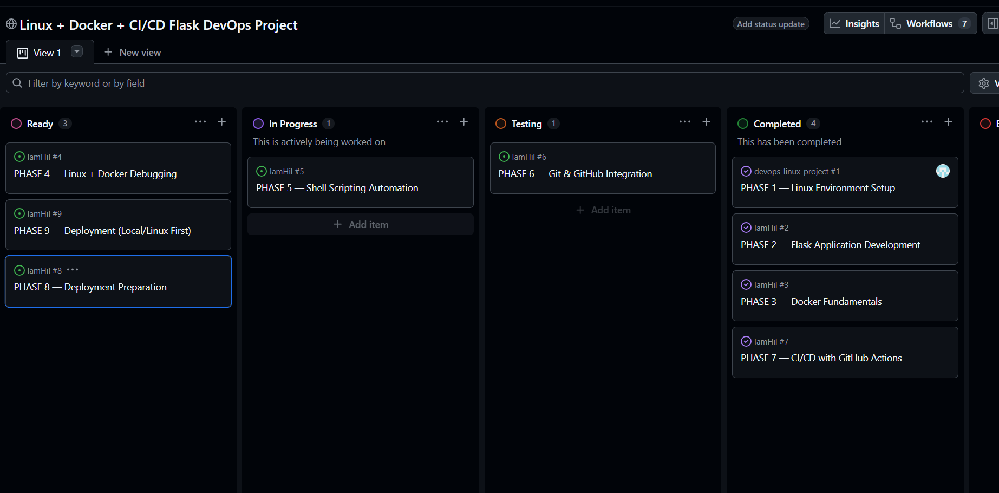
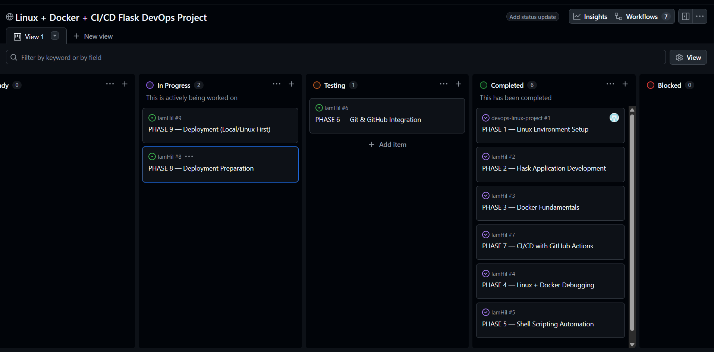
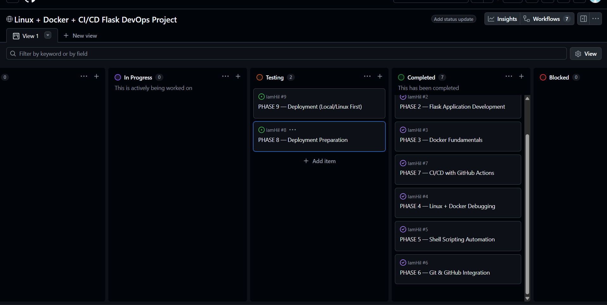
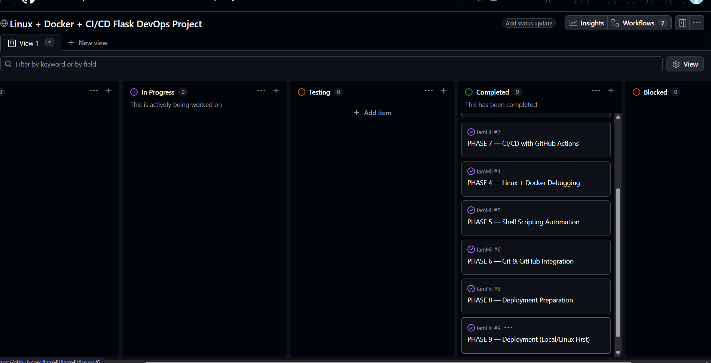

# DevOps Linux Project 🚀

A hands-on DevOps learning project focused on Linux system administration, Docker, CI/CD, automation, monitoring, and deployment workflows.

This project was built phase-by-phase to gain practical DevOps experience using real-world tools and workflows including:

* Linux
* Bash Scripting
* Docker
* Docker Compose
* GitHub Actions
* Cron Jobs
* Monitoring & Logging
* CI/CD Pipelines
* Deployment Automation

---

# Technologies Used

* Linux / WSL
* Bash Shell
* Docker
* Docker Compose
* Python Flask
* GitHub Actions
* Cron Jobs
* YAML
* Git & GitHub

---

# Project Structure

```bash
devops-linux-project/
│
├── .github/workflows/
│   └── ci.yml
│
├── app/
│   ├── requirements.txt
│   └── server.py
│
├── backups/
│
├── cronjobs/
│
├── docker/
│   └── Dockerfile
│
├── logs/
│
├── monitoring/
│
├── scripts/
│   ├── backup.sh
│   ├── cleanup_logs.sh
│   ├── disk_monitor.sh
│   └── health_check.sh
│
├── .env
├── .gitignore
├── docker-compose.yml
└── README.md
```

---

# PHASE 1 Tasks

## Steps 1 : Create direcotries and folders using linux commands only

## Step 2 : Write the necessary codes in the Bash terminal
 - Create the flask application via linux command "nano"

 - Adding commands in Docker file

 - Create the docker file and build it 

## PHASE 1 COMPLETED 

[Link](https://github.com/users/IamHil/projects/2/views/1?pane=issue&itemId=186264066&issue=IamHil%7Cdevops-linux-project%7C1)


---

# PHASE 2 Tasks

✅ Linux filesystem
✅ Bash scripting
✅ Linux permissions
✅ Monitoring
✅ Log management
✅ Backups
✅ Cron jobs
✅ Docker operations
✅ Automation
✅ System administration basics

## PHASE 2 COMPLETED

[Link](https://github.com/users/IamHil/projects/2/views/1?pane=issue&itemId=186264639&issue=IamHil%7CIamHil%7C2)


---

# PHASE 3 and 7 Tasks

✅ GitHub Actions
✅ YAML workflows
✅ Docker Compose
✅ Automated tests
✅ Automated builds
✅ Container verification
✅ CI debugging
✅ Pipeline troubleshooting


✅ Understand CI/CD basics
✅ Create .github/workflows
✅ Create ci.yml
✅ Configure workflow trigger
✅ Install dependencies in pipeline
✅ Add Flask validation step
✅ Add Docker build step
✅ Test CI pipeline
✅ Fix CI failures
✅ Verify successful pipeline execution
✅ Add status badge to README

## PHASE 3 and 7 COMPLETED 

[Phase 3](https://github.com/users/IamHil/projects/2/views/1?pane=issue&itemId=186264864&issue=IamHil%7CIamHil%7C3)

[Phase 7](https://github.com/users/IamHil/projects/2/views/1?pane=issue&itemId=186265652&issue=IamHil%7CIamHil%7C7)



---

# PHASE 4 and 5 Tasks
✅ cron
✅ crontab
✅ background services
✅ Linux automation
✅ shell scripts
✅ log monitoring
✅ scheduled maintenance
✅ Docker container health monitoring


## PHASE 4 and 5 COMPLETED

[Phase 4](https://github.com/users/IamHil/projects/2/views/1?pane=issue&itemId=186265652&issue=IamHil%7CIamHil%7C4)

[Phase 5](https://github.com/users/IamHil/projects/2/views/1?pane=issue&itemId=186265652&issue=IamHil%7CIamHil%7C5)




---

# PHASE 6 Tasks

[Phase 6](https://github.com/users/IamHil/projects/2/views/1?pane=issue&itemId=186265652&issue=IamHil%7CIamHil%7C6)


## PHASE 6 COMPLETED



---

# PHASE 8 AND 9 Tasks

[Phase 4](https://github.com/users/IamHil/projects/2/views/1?pane=issue&itemId=186265652&issue=IamHil%7CIamHil%7C8)

[Phase 4](https://github.com/users/IamHil/projects/2/views/1?pane=issue&itemId=186265652&issue=IamHil%7CIamHil%7C9)

## PHASE 8 AND 9 COMPLETED



---

# Future Improvements

* Deploy on AWS EC2
* Add Nginx reverse proxy
* Configure HTTPS with SSL
* Add Prometheus monitoring
* Add Grafana dashboards
* Add Kubernetes deployment
* Push images to Docker Hub

---

# Automation scripts included:

* Health monitoring
* Disk usage monitoring
* Backup automation
* Log cleanup automation

All scripts are executed using cron jobs inside Linux/WSL.

---

### This project demonstrates practical knowledge of 

* Linux Administration
* Docker & Containerization
* CI/CD Pipelines
* Bash Scripting
* Monitoring & Logging
* GitHub Actions
* Deployment Workflows
* Automation Engineering
* DevOps Fundamentals

---

# Final Result

This project was built completely from scratch while learning DevOps step-by-step through practical implementation and debugging.

The main goal of this project was to gain real hands-on DevOps experience using linux instead of only learning theory.