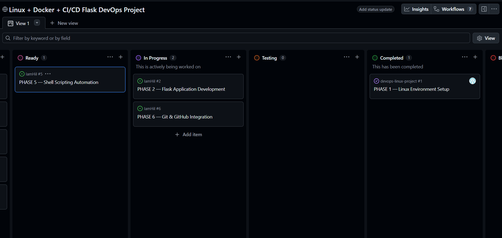
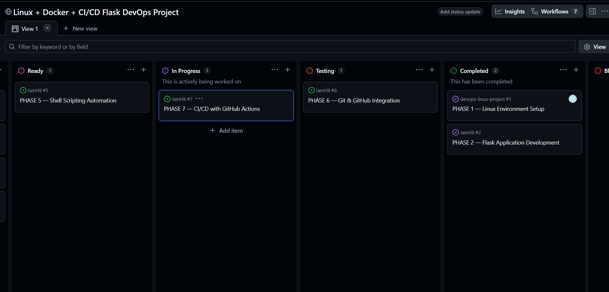

# Devops-linux-project

# PHASE 1 Tasks

## Steps 1 : Create direcotries and folders using linux commands only

## Step 2 : Write the necessary codes in the Bash terminal
 - Create the flask application via linux command "nano"

 - Adding commands in Docker file

 - Create the docker file and build it 

## PHASE 1 COMPLETED 

[text](https://github.com/users/IamHil/projects/2/views/1?pane=issue&itemId=186264066&issue=IamHil%7Cdevops-linux-project%7C1)

# PHASE 2 Tasks

✅ Linux filesystem
✅ Bash scripting
✅ Linux permissions
✅ Monitoring
✅ Log management
✅ Backups
✅ Cron jobs
✅ Docker operations
✅ Automation
✅ System administration basics

## PHASE 2 COMPLETED

[text](https://github.com/users/IamHil/projects/2/views/1?pane=issue&itemId=186264639&issue=IamHil%7CIamHil%7C2)

