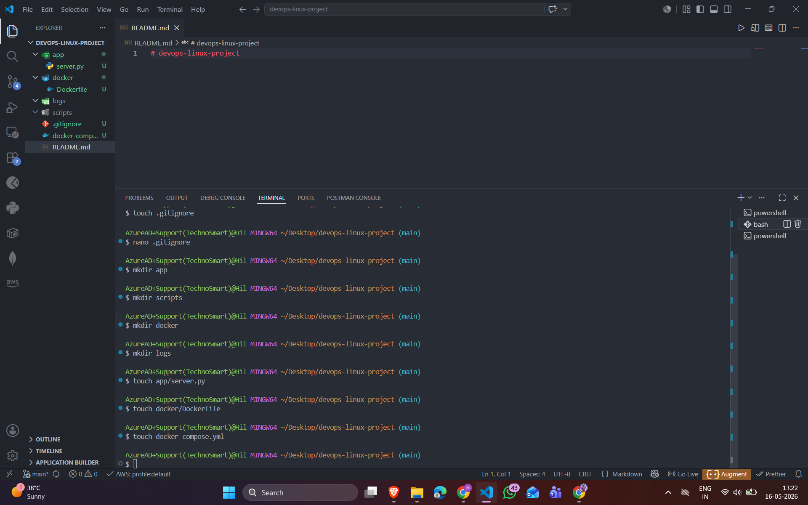
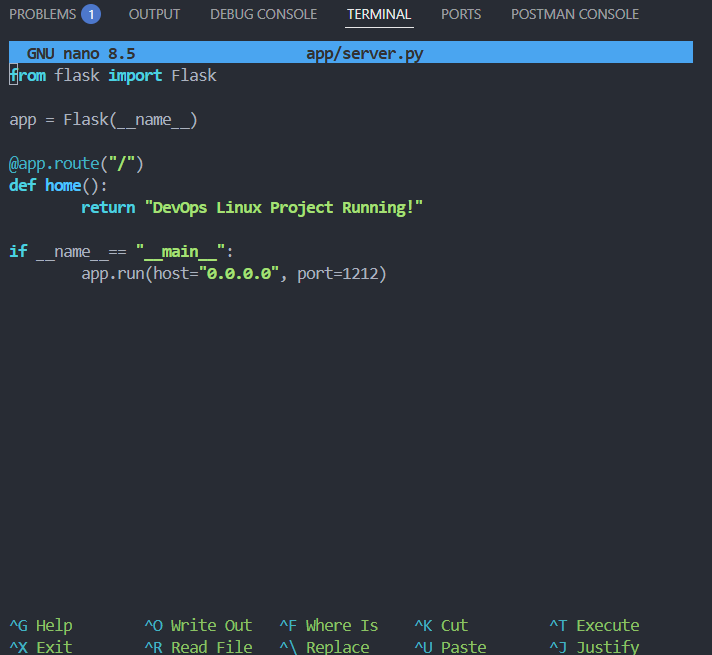
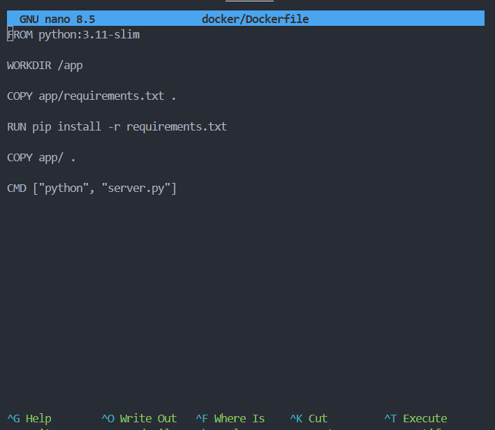
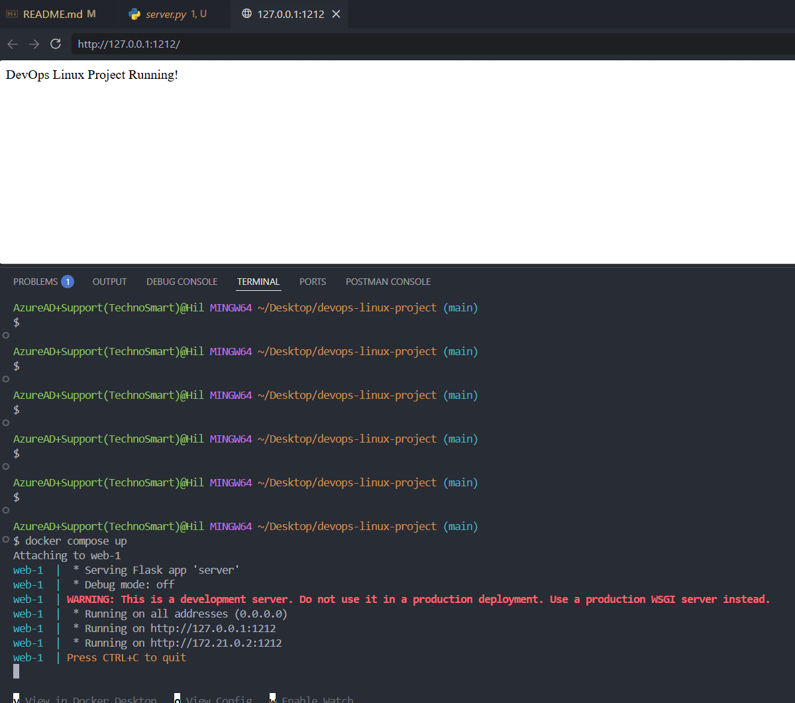

# devops-linux-project

Steps 1 : Create direcotries and folders using linux commands only

Step 2 : Write the necessary codes in the Bash terminal

Adding commands in Docker file

Create the docker file and build it 

